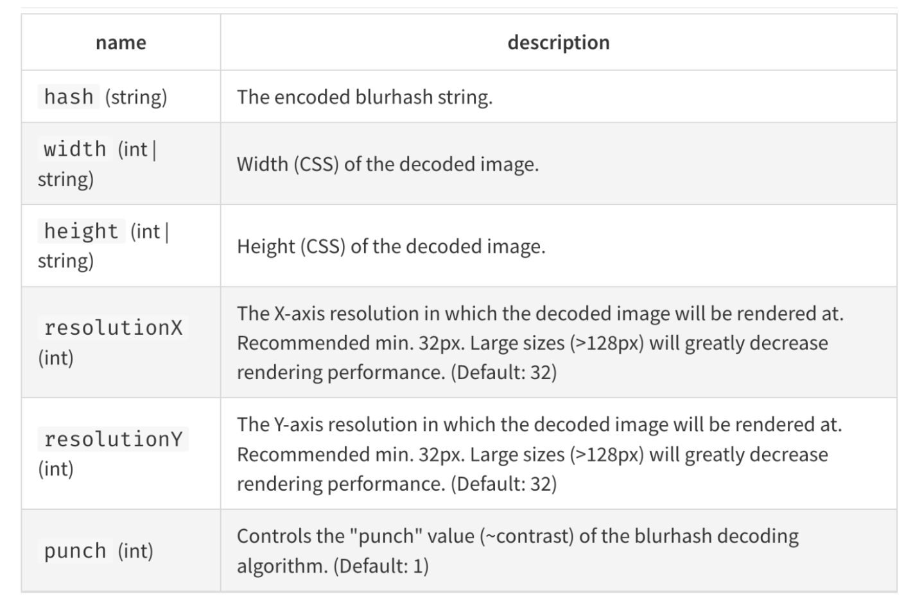

# [Компонент LazyPicture c BlurHash к статье](добавить ссылку)

Before moving on to the front end implementation, we have implemented a small microservice that you can pull up from a docker image that can generate base83 for your images. The microservice is available in [repository](https://github.com/dev-family/blurhash): 

## List of component props:

```tsx
export interface LazyPictureProps {
data: IPicture;
alt?: string;
placeholder?: string;
breakpoints?: IBreakpoints;
onLoadSuccess?: (img: EventTarget) => void;
onLoadError?: () => void;
className?: string;
}


export interface IBreakpoints {
desktop: string;
tablet: string;
mobile: string;
}
```


## The component itself:
```tsx
export default memo(function LazyPicture({
  data,
  onLoadError,
  onLoadSuccess,
  className = "",
  ...props
}: LazyPictureProps) {
  const [isLoaded, setIsLoaded] = useState(false);
  const { placeholder, ...imageProps } = data;
  const imgPlaceholder = useMemo(
    () => placeholder || defaultBlurPlaceholder,
    [placeholder]
  );


  const [imageSrc, setImageSrc] = useState<IPicture>(defaultImageProps);


  const imageRef = useRef<HTMLImageElement>(null);


  const _onLoad: ReactEventHandler<HTMLImageElement> = (event) => {
    const img = event.target;
    if (onLoadSuccess) onLoadSuccess(img);
      setIsLoaded(true);
    };
  }
```

 
* Set the base flag `isLoaded` to change styles and monitor loading status
* `imgPlaceholder` - that's the line `blurhash`
* `imageSrc` - The link to the source image will be set here (by default an empty string. or, as in our case, an object of several fields).
* `imageRef` - to track when a picture is in the user's field of view
* `onLoad` - handler of successful image loading


## We add useEffect, which does most of the work:
```tsx
useEffect(() => {
  let observer: IntersectionObserver;
  if (IntersectionObserver) {
    observer = new IntersectionObserver(
      (entries) => {
        entries.forEach((entry) => {
        // when image is visible in the viewport + rootMargin
          if (entry.intersectionRatio > 0 || entry.isIntersecting) {
            setImageSrc(imageProps);
            imageRef?.current && observer.unobserve(imageRef?.current);
          }
        });
      },
      {
        threshold: 0.01,
        rootMargin: "20%",
      }
    );
    imageRef?.current && observer.observe(imageRef?.current);
    } else {
      // Old browsers fallback
      setImageSrc(imageProps);
    }
    return () => {
      imageRef?.current && observer.unobserve(imageRef.current);
    };
}, []);
```

Use `IntersectionObserver` to track when an image comes into range, when it does - net the data in `Picture` and cancel the subscription.

## jsx:
```jsx
return (
  <StyledLazyImage>
    <StyledBlurHash isHidden={isLoaded}>
      <Blurhash
        hash={imgPlaceholder}
        width={"100%"}
        height={"100%"}
        resolutionX={32}
        resolutionY={32}
        punch={1}
      />
    </StyledBlurHash>
    <Picture
      ref={imageRef}
      {...imageSrc}
      {...props}
      className={`${className} ${!isLoaded && "lazy"}`}
      onLoad={_onLoad}
      onLoadError={onLoadError}
     />
  </StyledLazyImage>
);
});
```

Here `styled-components` used, but it's not crucial.

## `StyledLazyImage` - div container, its styles: 
```tsx
const StyledLazyImage = styled.div`
  width: 100%;
  height: 100%;
  position: relative;
  canvas {
    width: 100%;
    height: 100%;
  }
  .lazy {
    opacity: 0;
  }
`;
```

## `Blurhash` - is a component of the `react-blurhash` library, its props are:

## `StyledBlurhash` - container for the `Blurhash` component, its styles:
```tsx
const StyledBlurHash = styled.div<{ isHidden?: boolean }>`
  position: absolute;
  width: 100%;
  height: 100%;
  z-index: 22222;
  visibility: visible;
  transition: visibility 0.2s, opacity 0.2s;
  ${({ isHidden }) =>
    isHidden &&
      css`
        visibility: hidden;
        opacity: 0;
        animation: ${displayAnim} 0.2s;
      `
  }
`;


const displayAnim = keyframes`
  to {
    display: none;
  }
`;
```
The speed and smoothness of `Blurhash` hiding can be adjusted via `transition` and `animation`.

## `Picture` - picture component:
(it can be replaced by NextImage or any other, it should return an image)
```tsx
const Picture = forwardRef<any, PictureProps>((props, imageRef) => {
  const {
    noImageOnTouch = false,
    alt = "",
    onLoad,
    onLoadError,
    className = "",
  } = props;
  const desktopImages: PictureSources =
    props.desktop || defaultImageProps.desktop;
  const {
    x1: desktop_x1,
    x2: desktop_x2,
    webp_x1: desktop_webp_x1,
    webp_x2: desktop_webp_x2,
  } = desktopImages;


  const tabletImages: PictureSources =
    props.tablet || props.desktop || defaultImageProps.tablet;
  const {
    x1: tablet_x1,
    x2: tablet_x2,
    webp_x1: tablet_webp_x1,
    webp_x2: tablet_webp_x2,
  } = tabletImages;


  const mobileImages: PictureSources = props.mobile || defaultImageProps.mobile;
  const {
    x1: mobile_x1,
    x2: mobile_x2,
    webp_x1: mobile_webp_x1,
    webp_x2: mobile_webp_x2,
  } = mobileImages;
```
It takes references to all types of images and nets them in the `<picture />`

```tsx
return !Object.keys(props).length ? (
    
  ) : desktop_x1 && desktop_x1.endsWith(".svg") ? (
    
  ) : (
    <picture>
      {noImageOnTouch && (
        <source
          media="(hover: none) and (pointer: coarse), (hover: none) and (pointer: fine)"
          srcSet={base64Pixel}
          sizes="100%"
        />
      )}
      <source
        type="image/webp"
        media={`(min-width: 1025px)`}
        srcSet={`${desktop_webp_x1}, ${desktop_webp_x2} 2x`}
      />
      <source
        media={`(min-width: 1025px)`}
        srcSet={`${desktop_x1}, ${desktop_x2} 2x`}
      />
      <source
        type="image/webp"
        media={`(min-width: 501px)`}
        srcSet={`${tablet_webp_x1}, ${tablet_webp_x2} 2x`}
      />
      <source
        media={`(min-width: 501px)`}
        srcSet={`${tablet_x1}, ${tablet_x2} 2x`}
      />


      <source
        type="image/webp"
        media={`(max-width: 500px)`}
        srcSet={`${mobile_webp_x1}, ${mobile_webp_x2} 2x`}
      />
      <source
        media={`(max-width: 500px)`}
        srcSet={`${mobile_x1}, ${mobile_x2} 2x`}
      />
      
    </picture>
  );
});

Picture.displayName = "Picture";
export default Picture;
```

